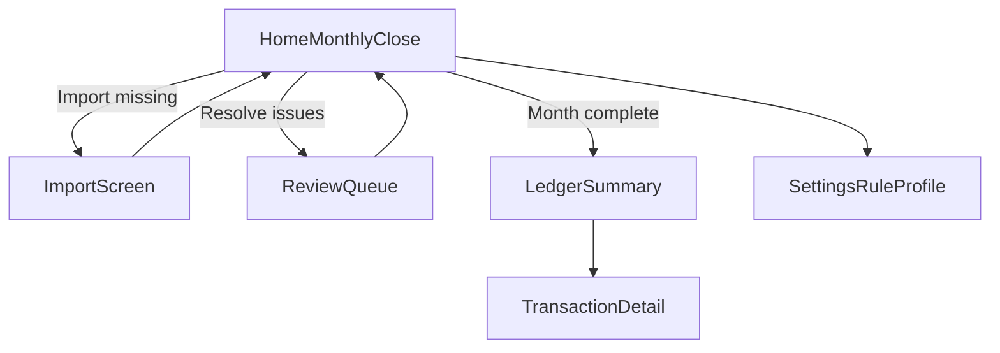

# Personal Finance Tracker - Design Mocks (v1)

Source docs:
- [PRODUCT_REQUIREMENTS.md](PRODUCT_REQUIREMENTS.md)
- [DESIGN_REQUIREMENTS.md](DESIGN_REQUIREMENTS.md)
- [ENGINEERING_REQUIREMENTS.md](ENGINEERING_REQUIREMENTS.md)

Use this file as a low/mid-fidelity mock pack for implementation and Figma translation.
This file is illustrative and non-normative. Behavioral/source-of-truth requirements live in [DESIGN_REQUIREMENTS.md](DESIGN_REQUIREMENTS.md).

## 1) Mock Set and Scope

Required screens:
1. Home / Monthly Close
2. Import
3. Review Queue
4. Ledger + Transaction Detail
5. Settings / Rule Profile

Required states:
- First run (empty)
- In-progress month
- Needs review pending
- Month complete
- Import warnings/errors

Device scope:
- Desktop/laptop only (Windows-first executable app).

---

## 2) Screen A - Home / Monthly Close

### A1. Layout Wireframe

```text
+----------------------------------------------------------------------------------+
| Personal Finance Tracker                           [Month: 2026-03 v] [Settings] |
+----------------------------------------------------------------------------------+
| Monthly Close Status                                                               |
| [ Continue monthly close ]  Reason: 2 statements missing                          |
|                                                                                   |
| Import Coverage                                                                   |
|  Progress: 2 of 4 required statements uploaded                                    |
|  [ ] Primary Bank   [x] Secondary Bank   [ ] Card Account A   [x] Card Account B |
|                                                                                   |
| Review                                                                            |
|  Needs review: 3 items   [Go to Review]                                           |
|                                                                                   |
| Health                                                                            |
|  Last import: 2026-03-30 21:14   Parser warnings: 2                              |
|                                                                                   |
| Quick actions: [Import statements] [Open Ledger]                                  |
+----------------------------------------------------------------------------------+
```

### A2. CTA Behavior Contract

`Continue monthly close` routes by deterministic order:
1. Missing statements -> `Import`
2. Needs review > 0 -> `Review`
3. Otherwise -> monthly summary/ledger

### A3. State Variants

- **First run empty**
  - Coverage all unchecked
  - `Continue monthly close` reason: `<N> statements missing`
  - Primary CTA: `Import statements`
- **Month complete**
  - Coverage complete, review count 0
  - CTA reason: `Month ready. View summary`

### A4. Configurability Note

- Import Coverage must be generated from the active rule profile/account configuration, not hardcoded bank names.
- The UOB/DBS setup is a default profile example only.

---

## 3) Screen B - Import

### B1. Layout Wireframe

```text
+----------------------------------------------------------------------------------+
| Import Statements                                              [Back to Home]     |
+----------------------------------------------------------------------------------+
| [ Drag and drop files here ]   [Choose files]                                    |
|                                                                                   |
| Processing Summary                                                                 |
|  Imported: 212 txns   Warnings: 2   Needs review: 3                              |
|                                                                                   |
| Files                                                                              |
| +----------------------+---------+------+-----------+---------------------------+ |
| | Filename             | Bank    | Type | Period    | Status                    | |
| +----------------------+---------+------+-----------+---------------------------+ |
| | uob_bank_mar.pdf     | UOB     | BANK | 2026-03   | Success                   | |
| | dbs_card_mar.pdf     | DBS     | CARD | 2026-03   | Success                   | |
| | uob_card_mar.pdf     | UOB     | CARD | 2026-03   | Needs attention (1 warn) | |
| | random_file.pdf      | Unknown | ?    | -         | Failed: unsupported file | |
| +----------------------+---------+------+-----------+---------------------------+ |
|                                                                                   |
| [Retry failed] [Go to Review]                                                     |
+----------------------------------------------------------------------------------+
```

### B2. Required Interactions

- Multi-file upload via drag/drop or picker
- Per-file status row with actionable errors
- Non-destructive duplicate message: `Already imported`
- Optional explicit `Reprocess` action only when allowed by engineering

### B3. Copy Snippets

- Duplicate: `This file was already imported. No new transactions were added.`
- Unsupported format: `We could not parse this file. Supported format(s): <configured>.`

---

## 4) Screen C - Review Queue

### C1. Layout Wireframe

```text
+----------------------------------------------------------------------------------+
| Review Queue                                                   3 items remaining  |
+----------------------------------------------------------------------------------+
| Item 1/3                                                                          |
| Bank transaction                                                                   |
|  2026-03-28  UOB BANK  "UOB CARD PMT 1234"     -1200.00 SGD                      |
|                                                                                   |
| Suggested match                                                                    |
|  UOB Card statement period: 2026-03   Total: 1200.00 SGD                          |
|  Confidence: 0.81                                                                  |
|  Why: amount match, date within 2 days, mapped account                             |
|                                                                                   |
| [Confirm suggested link]  [Pick another candidate]  [Mark not settlement]         |
|                                                                                   |
| Candidate list (if multiple)                                                       |
|  - UOB Card 2026-02 total 1200.00 (confidence 0.63)                               |
+----------------------------------------------------------------------------------+
```

### C2. State Requirements

- Show reason codes in plain language
- Stable ordering (date desc, then severity/confidence)
- If no items: `All review items resolved`

### C3. User Action Outcomes

- Confirm -> `UserConfirmed`
- Pick another / mark not settlement -> `UserOverridden`
- All changes should reflect in spend totals immediately after save

---

## 5) Screen D - Ledger + Transaction Detail

### D1. Ledger Layout Wireframe

```text
+----------------------------------------------------------------------------------+
| Ledger                                               [Month: 2026-03 v] [Filters] |
+----------------------------------------------------------------------------------+
| Filters: [Account v] [Needs review only] [Settlement-related] [Search________]   |
|                                                                                   |
| +------------+---------------------------+---------+-------+--------------------+ |
| | Date       | Description               | Amount  | Acct  | Status             | |
| +------------+---------------------------+---------+-------+--------------------+ |
| | 2026-03-28 | UOB CARD PMT 1234         | -1200.0 | UOB   | SettlementExcluded | |
| | 2026-03-10 | Grocery Store             | -45.80  | UOBCC | Spend              | |
| | 2026-03-05 | UOB->DBS Transfer         | -1500.0 | UOB   | Transfer           | |
| +------------+---------------------------+---------+-------+--------------------+ |
+----------------------------------------------------------------------------------+
```

### D2. Transaction Detail Drawer

```text
+------------------------------------ Transaction Detail ---------------------------+
| Normalized fields                                                                |
|  Date: 2026-03-28   Amount: -1200.00 SGD   Direction: DEBIT                      |
|  Account/Card: UOB BANK                                                               |
|                                                                                   |
| Reconciliation                                                                    |
|  State: UserConfirmed                                                             |
|  Link: UOB Card period 2026-03                                                    |
|  Confidence: 0.81                                                                 |
|  Spend impact: SettlementExcluded                                                 |
|  Why: amount_match + within_window + account_map                                 |
|                                                                                   |
| Source trace                                                                      |
|  Import: uob_bank_mar.pdf  Row ref: 142                                           |
+----------------------------------------------------------------------------------+
```

---

## 6) Screen E - Settings / Rule Profile

### E1. Layout Wireframe

```text
+----------------------------------------------------------------------------------+
| Settings / Rule Profile                                          [Save Changes]  |
+----------------------------------------------------------------------------------+
| Profile name: [Default Profile____________________]                               |
|                                                                                   |
| Account mappings                                                                   |
|  Salary account: [UOB Main v]                                                     |
|  UOB card payment source: [UOB Main v]                                            |
|  DBS card payment source: [DBS Main v]                                            |
|                                                                                   |
| Transfer patterns                                                                  |
|  Pattern 1: From [UOB Main v] To [DBS Main v] [Enabled]                           |
|                                                                                   |
| Matching                                                                           |
|  Match window (days): [ 5 ]                                                       |
|  Confidence threshold: [ 0.75 ]                                                   |
|                                                                                   |
| Data                                                                               |
|  Local data path: C:\\Users\\<user>\\AppData\\...                                |
+----------------------------------------------------------------------------------+
```

### E2. Scope Guard

Do not include advanced rule-builder UI in v1 (no regex playground, no visual rule graph).

---

## 7) End-to-End Click Flow



---

## 8) Mock Acceptance Checklist

- Home includes reasoned `Continue monthly close` routing text.
- Import shows per-file statuses and aggregate outcomes.
- Review item includes bank txn, suggested link, confidence, reason, and actions.
- Ledger exposes reconciliation/spend-impact status and transaction detail explainability.
- Settings includes only MVP profile fields and local data path visibility.
- All screens are desktop-first and avoid mobile-specific layout assumptions.

---

## 9) Figma Translation Notes

- Use a 12-column desktop grid (1440 width baseline).
- Build reusable components:
  - Status badge (`Spend`, `Transfer`, `SettlementExcluded`, `NeedsReview`)
  - Import file row
  - Review item card
  - Explanation block
- Keep copy from this doc unless usability testing suggests simplification.

## 10) Future Navigation Placeholder Note (Optional, Non-MVP)

- Reserve room in the top-level navigation pattern for future modules such as `Investments`, `Rewards`, and `Insights`.
- Do not design those modules in v1 mocks; this note is only to avoid repainting the shell layout later.
