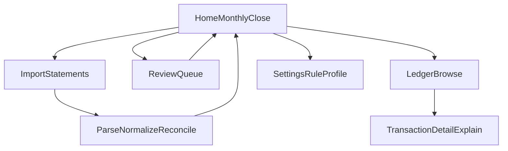

# Personal Finance Tracker - Design Requirements (v1)

Upstream document: [PRODUCT_REQUIREMENTS.md](PRODUCT_REQUIREMENTS.md). This doc defines **what to design** for MVP (UX, IA, and interaction patterns). Implementation details belong in the engineering doc.

## 1) Design Goals

- **Trust first**: Users must believe totals are correct; explainability beats density.
- **Monthly close in one path**: Upload → process → review exceptions → see results without hunting.
- **Local-only is visible**: No sign-in, no cloud badges; optional subtle copy that data stays on device.
- **Correctness over speed**: Ambiguous cases go to review; the UI must not hide uncertainty.

## 2) Target Platform (MVP)

- Primary: packaged local desktop executable (Windows-first in v1).
- Usage target: laptop/desktop only for v1.
- Input: file upload is the primary interaction for statements.
- No mobile or tablet-specific design requirements in v1.

## 2.1) First-Run and Executable UX Requirements

- App must launch from an installed executable package with no terminal commands required.
- First run should show a minimal startup state quickly (splash/loading optional) and route to Home.
- If local data directory initialization fails, show a clear recovery message and retry path.
- Include a lightweight local-only indicator in-app (for trust), without noisy repeated prompts.

## 3) Information Architecture

Top-level areas (navigation labels are suggestions):

| Area | Purpose |
|------|---------|
| **Home / Monthly close** | Guided flow for the current month: import status, review count, summary. |
| **Import** | Upload statements, see per-file result (success, partial, error), import history. |
| **Ledger** | Browse normalized transactions with filters; drill to source row. |
| **Review** | Queue of `NeedsReview` reconciliation items; primary exception workflow. |
| **Settings** | Rule profile, account/card mappings, thresholds (as exposed in MVP), data location. |

**MVP default**: land user on **Home** with a clear primary action: **Import statements** or **Continue monthly close**.

### 3.1 Continue Monthly Close (CTA Behavior Contract)

- The CTA must route users to the next unresolved step for the selected month using this order:
  1. Missing required statement imports.
  2. Unresolved `NeedsReview` reconciliation items.
  3. Monthly summary/ledger view when the month is complete.
- The CTA label or helper text must state the reason for routing (for example: "2 statements missing" or "3 items need review").
- Users must still be able to navigate directly to Import, Review, or Ledger from Home.

## 4) Core User Flows (Design-Level)

### 4.1 Standard monthly close

1. User opens app → Home shows **coverage** for selected month (which bank/card statements are present).
2. User uploads missing files (batch upload supported).
3. After processing, Home shows **Review (N)** if any item needs attention.
4. User clears Review queue.
5. Home shows **month summary** with spend that respects double-count rules (high-level numbers only in v1 if reporting is minimal).

### 4.2 Re-import / duplicate file

- On duplicate detection: non-destructive message, e.g. **“This file was already imported”** with option to **reprocess** or dismiss.
- No silent ledger duplication; user sees confirmation that nothing changed (or what changed if reprocess is supported).

### 4.3 Low-confidence settlement

- Item appears in **Review** with **why** it needs attention (multiple candidates, amount/date mismatch, missing card statement, etc.).
- User actions: **Confirm suggested link**, **Pick another candidate**, **Mark as not settlement** (exact labels TBD with engineering).

## 5) Key Screens (MVP)

### 5.1 Home / Monthly close

**Must show**

- Selected month (picker).
- **Import coverage** checklist: UOB bank, DBS bank, UOB card, DBS card (or generic “accounts configured in rule profile”).
- **Review count** badge when `NeedsReview` > 0.
- Short **health strip**: last successful import timestamp; parser warnings count if any.

**Empty state**

- No statements yet: single CTA to Import; short privacy line (“Runs locally; your files stay on this computer”).

### 5.2 Import

**Must support**

- Drag-and-drop and file picker; multi-file.
- Per-file row: filename, detected institution/type (if inferable), statement period (if parsed), status (success / needs attention / failed).
- Aggregate outcome: “X transactions imported, Y warnings, Z need review.”

**Error design**

- Parse failure: show **actionable** message (unsupported format, wrong bank, corrupt file) and **do not** partially corrupt user perception—failed file is clearly isolated.
- If parser detects non-transaction statement sections (headers/footers/legal pages), surface as informational processing notes, not user-facing failures.

### 5.3 Ledger

**Must support**

- Sortable table: date, description, amount, account, **reconciliation badge** (e.g. Matched / Needs review / Excluded from spend).
- Row click → **detail drawer or page** with:
  - normalized fields,
  - link to raw source snippet/line reference,
  - reconciliation explanation (per NFR-4).

**Filters (MVP minimum)**

- Month range, account, needs-review only, settlement-related only.

### 5.4 Review queue

**Purpose**: primary surface for FR-7 and Scenario C.

**Each item must show**

- The **bank-side** transaction(s) in question.
- **Suggested link** (if any) to card billing cycle / card statement.
- **Confidence** and **reason codes** in plain language (not only numeric score).
- **Actions**: confirm, override, dismiss (semantics aligned with engineering).
- When available, show extracted payment markers used by matching (for example masked card number and payment channel token) to increase user trust.

**Batching**

- If multiple items: list with stable ordering (date, severity); optional “confirm all high-confidence” only if product explicitly allows (default: conservative, no bulk confirm in v1 unless specified).

### 5.5 Settings / Rule profile

**MVP expectation**

- Enough configuration to satisfy PRD Section 11 without building a full rules IDE.
- Present as **forms**: account mappings, transfer patterns, match window, confidence threshold.
- **Explain** each field with one line of help text and an example.
- Scope guard: do not add advanced rule authoring UI in v1 beyond these forms.

**Out of v1 UI (unless promoted)**

- Visual rule builder, regex playground, import/export of rule packs (PRD “Could have”).

## 6) Reconciliation UX Contract

Users should always understand:

- **What** was linked.
- **Why** (rule name / pattern / amount-date match).
- **How it affects spend** (settlement excluded from spend when card lines exist).

**State mapping (UI labels vs internal)**

| Internal | Suggested user-facing label |
|----------|-----------------------------|
| `AutoMatched` | Matched |
| `NeedsReview` | Needs review |
| `UserConfirmed` | Confirmed |
| `UserOverridden` | Edited by you |

## 7) Double-Count Prevention (User Mental Model)

- **Card transactions** = spend (by default).
- **Bank settlement payment** linked to those card lines = **not additional spend**; show as **Settlement / transfer** or **Excluded from spend** with explanation.
- **Inter-bank transfer** (e.g. UOB → DBS) = **not spend**; show as **Transfer**.

Use consistent iconography or tags for: **Spend**, **Transfer**, **Settlement**, **Needs review**.

## 8) Feedback & System States

- **Loading**: per-import progress; avoid blocking entire app without feedback.
- **Success**: concise summary + link to Review if needed.
- **Warnings**: parser ambiguity (e.g. unrecognized row)—surface count; do not fail silently.
- **Incomplete month**: Home should show **missing statement types** so user knows totals may be incomplete.
- **Startup/install issues**: user-friendly errors for launch failure, missing permissions, or unreadable data path.

## 9) Privacy & Trust Copy

- Short, non-intrusive statement near Import and Settings: local-only processing; no account linking.
- Settings: show **data directory path** (per NFR-1) with “open folder” affordance on desktop OS if engineering supports it later; v1 may be path string only.

## 10) Accessibility (Baseline)

- Keyboard operability for primary flows (upload, navigate table, review actions).
- Sufficient contrast; do not rely on color alone for reconciliation status (pair with text/icon).
- Focus management in modals/drawers.

## 11) Design Out of Scope (v1)

- Rich dashboards and charting beyond simple monthly summary (align with PRD MVP).
- Bank branding-heavy UI themes per institution.
- Mobile-first layout polish.
- Collaborative/multi-user interfaces.

## 11.1) IA Extensibility Guardrails (Non-MVP)

- Information architecture should allow future modules (for example `Investments`, `Rewards`, `Insights`) without redesigning the MVP navigation shell.
- Prefer reusable labels where possible (for example `Accounts`, `Sources`, `Transactions`) over institution-specific naming in shared UI components.
- Dashboard/chart UX is deferred, but layout primitives should remain compatible with future metric cards and chart containers.

## 12) Open Design Decisions

- **Statement format**: PDF vs CSV changes layout density and error UX—finalize before high-fidelity UI.
- **Review queue depth**: single-step resolution vs wizard for complex many-to-one settlements.
- **Month summary content**: cash-flow vs spend-only summary for v1.
- **Desktop wrapper details**: whether to surface app version/update prompt in UI for packaged releases.

## 12.1) Evidence-Based UX Constraints (from UOB Samples)

- Import/result UI should tolerate multi-line transaction parsing outcomes without breaking row readability.
- Review UI should support cross-cycle explanation text (for example payment posted end-of-month, credited in next card statement cycle).
- For same-day multi-card settlements, review and detail views should clearly distinguish card-level links (not only aggregate totals).

## 12.2) Evidence-Based UX Constraints (from DBS/POSB Samples)

- Review and detail views should display payment reference identifiers when present, because DBS bank and card statements expose matching `REF` / `REF NO` values.
- Import UI should clearly communicate when non-transaction sections were ignored during processing, without surfacing them as failures.
- For DBS settlement matches, explanation text should explicitly surface card-number marker + reference-based evidence for user trust.

## 13) Traceability to PRD

| PRD area | Design response |
|----------|-----------------|
| FR-2 import | Import screen + per-file outcomes |
| FR-4 ledger states | Badges + detail explanation |
| FR-5–FR-6 settlement | Review + ledger tagging + summary rules |
| FR-7 manual handling | Review queue + overrides |
| NFR-4 explainability | Detail drawer content contract |
| NFR-5 executable/offline operation | Target platform + first-run executable UX + startup/install error states |
| UC-1 / UC-2 | Transfer vs settlement labeling consistency |

## 14) Design Flow Diagram (MVP)

## 15) Handoff to Engineering (Next Doc Inputs)

- Confirm desktop executable packaging/toolchain and installer behavior for Windows-first release.
- Specify data directory creation, migration, and recovery behavior referenced by first-run UX requirements.
- Define parser error taxonomy and machine-readable reason codes shown in Import and Review.
- Define reconciliation decision payload fields needed by UI (`what`, `why`, confidence, spend-impact tag).
- Define status computation contract that powers "Continue monthly close" routing deterministically.
