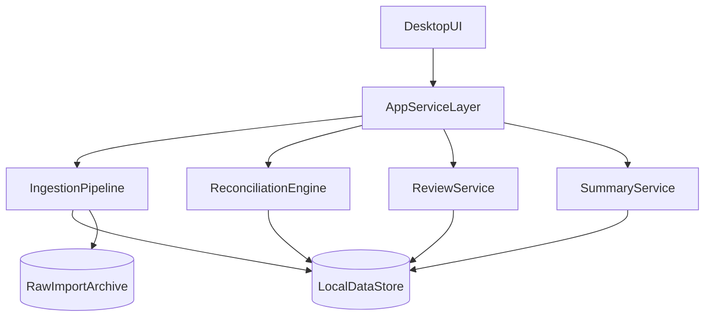

# Personal Finance Tracker - Engineering Requirements (v1)

Upstream docs: [PRODUCT_REQUIREMENTS.md](PRODUCT_REQUIREMENTS.md), [DESIGN_REQUIREMENTS.md](DESIGN_REQUIREMENTS.md).

## 1) Purpose

Define the MVP engineering architecture, module boundaries, data contracts, and verification strategy for a local-only, Windows-first executable personal finance tracker.

## 2) Engineering Principles

- Local-only by default: no runtime network dependency for core flows.
- Deterministic processing: same inputs + same rules -> same outputs.
- Idempotent imports: repeated uploads of the same statement do not duplicate ledger entries.
- Explainability-first: every reconciliation decision stores machine-readable reasons for UI.
- Fail-safe behavior: uncertain matches go to `NeedsReview`, not silent auto-accept.

## 3) Scope (Engineering MVP)

- Statement ingestion for UOB/DBS bank + UOB/DBS credit card statements.
- Normalization into a canonical transaction model.
- Reconciliation engine for settlement/transfer detection and double-count prevention.
- Review queue support with user decisions persisted.
- Packaged desktop executable for Windows-first release.

Out of scope:
- Bank APIs, cloud sync, multi-device sync, collaborative features.
- Full rule authoring IDE.
- Advanced analytics/dashboards.

## 4) Architecture Overview

## 5) Runtime and Packaging Requirements

- Delivery target: Windows-first packaged desktop executable installer.
- Core application must run without requiring terminal commands or developer setup.
- After install, runtime must function offline for all core workflows.
- Application startup must initialize/verify local data directory and DB schema safely.
- Future portability requirement: keep domain/reconciliation logic separate from packaging shell.

## 6) Proposed Technology Direction (MVP)

- Desktop shell: Tauri or Electron (final selection to be made in implementation kickoff).
- UI: single-page local frontend.
- Local API/service layer: in-process application service boundary (direct calls or local IPC).
- Data store: SQLite (recommended) for reliability, indexing, transactions, and queryability.
- Raw file storage: local filesystem archive with content hash addressing.

Note: this document specifies requirements, not a locked framework choice.

## 7) Module Boundaries

### 7.1 Import Module
- Accept files from UI, compute file hash, detect duplicates.
- Identify statement source type (UOB/DBS bank/card) and statement period.
- Persist import metadata and raw file reference.

### 7.2 Parser Module
- Convert supported statement formats into normalized rows.
- Emit parser warnings/errors with reason codes.
- Never mutate existing ledger rows directly; writes go through ingestion service contracts.
- Support multi-line transaction blocks and merge them into single normalized transaction records.
- Ignore repeated non-transaction boilerplate sections (headers, footers, legal/disclaimer content, payment advice pages).
- For consolidated bank statements, detect and exclude non-transaction account domains (for example SRS/portfolio/message sections) when generating deposit-account transactions.

### 7.3 Ledger Module
- Persist canonical transaction records and derived classification tags.
- Maintain source trace fields linking each row to import/job/source row.

### 7.4 Reconciliation Engine
- Detect transfer/settlement relationships.
- Score candidate matches and apply deterministic precedence rules.
- Emit reconciliation state: `AutoMatched`, `NeedsReview`, `UserConfirmed`, `UserOverridden`.
- Persist explanation payload for each decision.

### 7.5 Review Module
- Query unresolved reconciliation items.
- Apply user actions (confirm, remap, reject).
- Persist user decision artifacts for future identical matching conditions.

### 7.6 Summary Module
- Produce monthly totals with spend-exclusion rules.
- Ensure settlement and transfer items do not inflate spend totals.

## 8) Core Data Model (Minimum Contracts)

### 8.1 `imports`
- `id`
- `file_hash` (unique candidate)
- `filename`
- `source_institution` (`UOB`, `DBS`)
- `source_type` (`BANK`, `CARD`)
- `statement_period_start`, `statement_period_end`
- `imported_at`
- `status` (`SUCCESS`, `PARTIAL`, `FAILED`, `DUPLICATE`)
- `warning_count`, `error_count`

### 8.2 `transactions`
- `id`
- `import_id`
- `source_row_ref`
- `txn_date`
- `description_raw`
- `amount`
- `direction` (`DEBIT`, `CREDIT`)
- `currency`
- `account_or_card_id`
- `normalized_hash` (for dedupe/idempotency support)

### 8.3 `reconciliation_links`
- `id`
- `link_type` (`SETTLEMENT`, `TRANSFER`)
- `left_transaction_id`
- `right_transaction_id` (or group reference for many-to-one when needed)
- `confidence_score`
- `state` (`AutoMatched`, `NeedsReview`, `UserConfirmed`, `UserOverridden`)
- `reason_codes` (array/json)
- `explanation_text`
- `created_by` (`SYSTEM`, `USER`)
- `created_at`, `updated_at`

### 8.4 `rule_profiles`
- `id`
- `name`
- `account_mappings` (json)
- `transfer_patterns` (json)
- `description_patterns` (json)
- `match_window_days`
- `confidence_threshold`
- `priority_order` (deterministic precedence)

### 8.5 `monthly_status`
- `id`
- `month_key` (YYYY-MM)
- `required_imports_complete` (bool)
- `needs_review_count` (int)
- `is_month_close_complete` (bool)

## 9) Reconciliation Engine Contract

### 9.1 Candidate generation
- Generate match candidates by amount proximity, date window, account/card mapping, and description patterns.
- Support UOB and DBS settlement flows plus UOB->DBS transfer flow in MVP.
- Include marker extraction for known UOB patterns:
  - bank-side settlement markers such as `Bill Payment` + `mBK-UOB Cards` + masked card number,
  - card-side payment credit markers such as `PAYMT THRU E-BANK/HOMEB/CYBERB (EPxx) ... CR`.
- Include marker extraction for known DBS patterns:
  - bank-side settlement markers such as `Advice Bill Payment` + `DBSC-<card number> : I-BANK` + `REF`,
  - card-side payment credit markers such as `BILL PAYMENT - DBS INTERNET/WIRELESS` + `REF NO` + `CR`.

### 9.2 Deterministic resolution
- Apply rule precedence in fixed order.
- If highest-ranked candidate is below threshold or conflicting, mark `NeedsReview`.
- Never auto-classify ambiguous candidates as final spend-impacting matches.
- For same-day multiple card payments, resolve at card-level where masked card number or card identifier is available; do not collapse into one aggregate link.
- Allow cross-cycle matching windows for end-of-month payment and next-cycle credit visibility.
- If DBS bank/card reference numbers match and amount matches, prioritize this candidate as high-confidence unless conflicting signals exist.

### 9.3 Spend-impact tags
- Emit one spend-impact classification per relevant transaction:
  - `SPEND`
  - `TRANSFER`
  - `SETTLEMENT_EXCLUDED`
  - `UNRESOLVED_REVIEW`

### 9.4 User override behavior
- User actions transition state to `UserConfirmed` or `UserOverridden`.
- Reapply outcomes only for identical matching conditions (v1 constraint).

## 10) Import Idempotency Requirements

- Primary duplicate check: exact file hash match.
- Secondary protection: normalized transaction hash guardrail to prevent duplicate ledger rows.
- Re-import behavior:
  - Duplicate file -> no duplicate transaction inserts.
  - Optional reprocess path must be explicit and auditable.

## 11) Continue Monthly Close Status Contract

Status computation order (must be deterministic):
1. Missing required statements for selected month.
2. `NeedsReview` items remaining.
3. Month complete -> route to summary/ledger.

Service contract must provide:
- `next_action` (`IMPORT_MISSING`, `RESOLVE_REVIEW`, `VIEW_SUMMARY`)
- `reason_text` (user-facing short explanation)
- `month_key`

## 12) Error Taxonomy Requirements

Parser/import error categories (minimum):
- `UNSUPPORTED_FORMAT`
- `UNRECOGNIZED_STATEMENT_TYPE`
- `CORRUPT_FILE`
- `MISSING_REQUIRED_COLUMNS_OR_FIELDS`
- `PARTIAL_PARSE`

Reconciliation warning categories (minimum):
- `MULTIPLE_CANDIDATES`
- `LOW_CONFIDENCE`
- `MISSING_COUNTERPART_STATEMENT`
- `AMOUNT_DATE_MISMATCH`

Each surfaced warning/error must carry:
- machine-readable `code`
- human-readable `message`
- related `import_id` and/or transaction references

## 13) Security and Privacy Engineering Requirements

- Disable or avoid outbound runtime calls for core app features.
- Keep all user data under local app data directory.
- Do not log sensitive transaction details to external sinks.
- Local logs (if enabled) must be rotation-bounded and stored locally.

## 14) Performance and Reliability Targets

- Process a typical monthly 4-file import set in an interactive timeframe suitable for <15 minute monthly close.
- All write operations affecting imports/reconciliation must be transactionally safe.
- Crash/restart must not corrupt previously committed ledger/reconciliation state.

## 15) Testing Strategy

### 15.1 Unit tests
- Parser normalization per supported source type.
- Reconciliation rule precedence and confidence threshold behavior.
- Spend-impact classification logic.

### 15.2 Integration tests
- End-to-end import -> normalize -> reconcile -> review -> summary pipeline.
- Re-import same files -> no duplicate transactions.
- User override persistence and reapplication on identical conditions.

### 15.3 Acceptance tests (must-pass)
- UOB card settlement recognized and excluded from spend double counting.
- UOB salary -> UOB->DBS transfer -> DBS card settlement modeled correctly.
- Review queue created for ambiguous settlement cases.
- App launch/install flow works on Windows packaged build.
- UOB bank `Bill Payment` + `mBK-UOB Cards` rows map to corresponding UOB card accounts using amount/card marker evidence.
- UOB card `PAYMT THRU E-BANK/HOMEB/CYBERB (EPxx)` credit rows are parsed as payment credits and linked to bank-side settlements.
- Parser correctly excludes repeated statement boilerplate pages/sections from transaction output.
- DBS bank `Advice Bill Payment` + `DBSC-<card number>` rows map to DBS card payment credits using amount + reference evidence.
- DBS card `BILL PAYMENT - DBS INTERNET/WIRELESS` credit rows with `REF NO` are parsed and linked to corresponding DBS bank-side settlement rows.
- Consolidated DBS/POSB statement parser excludes non-deposit transaction domains (for example SRS/message sections) from deposit ledger rows.

### 15.4 Test data requirements
- Curated anonymized statement fixtures for UOB/DBS bank/card with known expected outcomes.
- Golden expected outputs for reconciliation links and monthly totals.

## 16) Milestones (Execution Plan)

1. Foundation: project skeleton, local DB, import metadata pipeline.
2. Parsers: first supported statement format(s) for UOB/DBS sources.
3. Reconciliation engine v1: deterministic matching + explainability payload.
4. Review workflow backend + UI integration.
5. Monthly summary + spend-exclusion correctness checks.
6. Windows packaging + installer validation.
7. Acceptance test pass and release candidate.

## 17) Engineering Decisions (Locked for v1)

- Desktop packaging/runtime: `Tauri` (Windows-first executable).
- Statement format sequence: `PDF-first` for initial v1 release.
- Settlement modeling: `one-to-one default + review fallback` for complex/ambiguous cases.
- Release update strategy: `manual reinstall` in v1.

## 17.1) Extensibility Guardrails (Must-Hold in v1 Implementation)

- Keep domain boundaries explicit so future domains (`SRS`, `investment`, `rewards`) can be added without refactoring cashflow core logic.
- Implement parser sources behind a consistent parser contract so new statement types can be introduced as additive modules.
- Use typed domain/category fields on normalized records/events instead of hardcoded bank/card-only assumptions.
- Keep reconciliation engine and rule execution isolated from UI-specific code paths.
- Build summary outputs as derived/read models so future dashboards/charts can be added without rewriting ingestion/reconciliation paths.
- Require additive schema migration strategy for new domains and analytics tables.

## 18) Evidence Appendix (Sample Statements)

- UOB samples include explicit bank-side card payment markers and card-side payment credit entries that support card-level settlement linking.
- DBS/POSB samples include bank-side and card-side payment rows with matching references that support high-confidence reconciliation.
- Both sample sets include repeated page boilerplate and consolidated-statement noise sections; parser must be section-aware.
