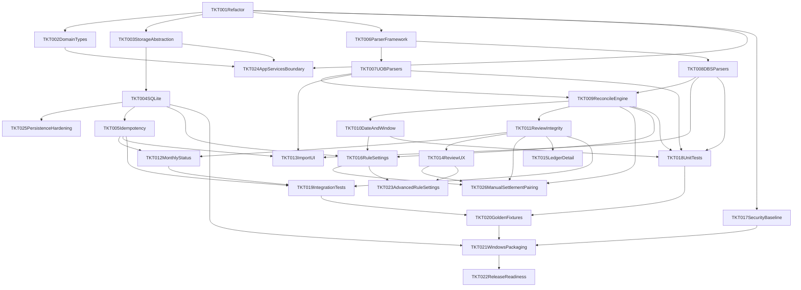

# Finny Implementation Tickets (v1)

This document breaks implementation into actionable tickets with dependencies and a recommended execution order.

References:
- [PRODUCT_REQUIREMENTS.md](PRODUCT_REQUIREMENTS.md)
- [DESIGN_REQUIREMENTS.md](DESIGN_REQUIREMENTS.md)
- [ENGINEERING_REQUIREMENTS.md](ENGINEERING_REQUIREMENTS.md)

## Current Implementation Reality (Snapshot)

- Frontend stack is React + TypeScript + Vite, packaged via Tauri.
- Tailwind CSS is already integrated (via PostCSS) and current UI styling uses utility classes.
- Core logic lives in `appServices/`, `parsers/`, `reconcile/`, `storage/`; `App.tsx` composes UI and wires storage.
- Persistence: Tauri uses SQLite under the app data directory (`src-tauri/src/db.rs`); development is **Tauri-only** (no standalone-browser persistence path).
- Initial load and save failures surface in the UI (empty workspace fallback on load failure; optimistic save with rollback on write failure).
- **Dev workflow:** Tauri-only (`npx tauri dev`). The browser-localStorage adapter and factory were removed; standalone `npm run dev` in a tab is not a supported persistence path.
- **Imports:** SHA-256 file hash on each import (SQLite `content_hash`); duplicate successful files are skipped. Transaction fingerprints dedupe re-imported rows. Parsing goes through `runStatementPipeline` → `parseTransactionsForSource` by source type.
- **Reconciliation:** `matchWindowDays` filters bank↔card candidates when both transaction dates parse; `statementDate` normalises common formats to ISO in parsers when possible.
- **Process:** New behavior follows **test-driven development** (see [Test-driven development](#test-driven-development-policy)); each backlog ticket states how TDD applies.

## Ticket Legend

- Priority: `P0` (must-have), `P1` (important), `P2` (nice-to-have for v1 hardening)
- Type: `Foundation`, `Backend`, `Frontend`, `Quality`, `Release`
- **TDD:** Every ticket includes a **TDD** line. Behavior-changing work uses red → green → refactor; details and exemptions are in [Test-driven development](#test-driven-development-policy).

## Test-driven development (policy)

Finny treats **test-driven development** as the default way to land code: express the requirement as an automated check first, implement until it passes, then refactor with tests green.

### Workflow

1. **Red:** Add or extend an automated test that fails under the current code (or documents a bug).
2. **Green:** Implement the smallest change that makes the suite pass (including `npm run test` in `finance-tracker`, and `cargo test` in `src-tauri` when Rust changes).
3. **Refactor:** Improve structure without changing behavior, keeping tests green.

Tests should land in the **same change** as the implementation (same PR / same merge), not in a follow-up unless the ticket explicitly splits “spike” vs “harden” (avoid shipping untested behavior).

### Where tests live

| Area | Convention |
|------|------------|
| TypeScript logic, parsers, services, UI-free hooks | Vitest: `src/**/*.test.ts` (see [Automated unit tests](#automated-unit-tests-vitest)) |
| Rust DB, migrations, IPC | `cargo test` / integration tests (see TKT-025, TKT-019) |
| React UI | Prefer extracting testable logic into functions covered by Vitest; add component or E2E coverage when the ticket is UI-primary (TKT-013–015) |

### Definition of Done (with TDD)

- A ticket is not **DONE** until its **TDD** acceptance is met: new or fixed behavior has matching automated coverage, and documented manual steps are only allowed where the policy exempts automation.
- **Legacy tickets** already marked DONE before this policy were not all implemented with TDD; any **reopen** or **follow-up** on those areas must follow this policy. Backfill coverage is tracked under TKT-018, TKT-019, and TKT-025 as appropriate.

### Tickets whose primary output is tests or release glue

- **TKT-018 / TKT-019 / TKT-020:** Deliverable is the suite or golden outputs — still follow red → green (add failing scenario first, then implement or fix production code until green).
- **TKT-021:** Automate what is practical (e.g. CI build of the installer); document repeatable manual smoke where automation is costly.
- **TKT-022:** Checklist must explicitly include **all automated tests passing**; other items may remain manual sign-off.

### Exemptions

- **Documentation-only** edits (no code or config that affects build/runtime) do not require new tests.
- **TKT-022** does not require new test *code* by itself, but must require verification that existing suites pass.

## Automated unit tests (Vitest)

Run from `finance-tracker`: `npm run test` (or `npm run test:watch`). Tests live under `src/**/*.test.ts` with shared text fixtures in `src/test/fixtures/statements.ts`.

| Ticket | Test file(s) | What is covered |
|--------|---------------|-----------------|
| **TKT-005** | `utils/fileHash.test.ts`, `import/transactionFingerprint.test.ts`, `appServices/finnyApp.test.ts` | SHA-256 hex helper; fingerprint stability/set; duplicate file skip, failed-import retry, duplicate row skip on re-import |
| **TKT-006** | `parsers/pipeline.test.ts`, `parsers/statementParser.test.ts` | Source detection; `runStatementPipeline` warnings and dispatch |
| **TKT-007** | `parsers/statementParser.test.ts` (+ fixtures) | Fixture-driven UOB bank/card line patterns (not full PDF corpus) |
| **TKT-008** | `parsers/statementParser.test.ts` (+ fixtures) | Fixture-driven DBS bank/card/FAST-style lines (not full PDF corpus) |
| **TKT-009** | `reconcile/reconcile.test.ts` | Ref-based `AutoMatched`; no match / ambiguous `NeedsReview`; `confidenceThreshold` behavior |
| **TKT-010** | `utils/statementDate.test.ts`, `reconcile/reconcile.test.ts` | `parseStatementDate` / ISO + DD/MM/YYYY + month-name; `matchWindowDays` gates candidates in `reconcile`; parsers emit ISO when parse succeeds |
| **TKT-011** | `appServices/finnyApp.test.ts` | `resolveReviewItem` confirm vs override; linked counterpart updated in sync; override clears `linkedTransactionId` |
| **TKT-012** | `appServices/monthlyClose.test.ts` | `getMonthlyCloseSummary` (four sources, FAILED imports ignored); `getReviewQueue` + ordering (see TKT-014); `inferMonthKey` + `getMonthlyStatus` (ER §11) |
| **TKT-018** | *See rows above* | Parser + pipeline + reconcile + fingerprint/hash + monthly close + import orchestration; gaps: deeper parser edge cases, golden outputs (TKT-020) |
| **TKT-013** | `appServices/importDisplay.test.ts`, `appServices/finnyApp.test.ts` | Import row outcome (`success` / `partial` / `failed`), failure taxonomy hints; `ImportPdfResult.session` (duplicate files + skipped txn rows); UI copy in `App.tsx` import tab |
| **TKT-014** | `reconcile/reviewExplain.test.ts`, `appServices/monthlyClose.test.ts` | Review reason codes (`NO_COUNTERPART_IN_WINDOW`, `DATE_OUTSIDE_MATCH_WINDOW`, `LOW_CONFIDENCE`, `AMBIGUOUS_CANDIDATES`, `CARD_CREDIT_UNMATCHED`); markers + import file; stable review queue sort |
| **TKT-015** | `appServices/ledgerView.test.ts` | `filterLedgerTransactions` (source / needs review / settlement-only); `buildLedgerDetailModel` (import trace, link peer, review vs reconciled copy) |
| **TKT-019** | `appServices/finnyApp.test.ts`, `appServices/finnyApp.integration.test.ts` | Import → reconcile (incl. DBS auto-match chain), `ImportPdfResult.session` dedupe signals, monthly status → `resolveReviewItem` → `VIEW_SUMMARY`; **no** SQLite / IPC round-trip (TKT-025) |
| **TKT-024** | `appServices/finnyApp.test.ts` | Service-layer import and review/profile helpers under test |
| **TKT-016** | `reconcile/settlementCandidates.test.ts`, `reconcile/reconcile.test.ts`, `reconcile/reviewExplain.test.ts`, `appServices/finnyApp.test.ts` | `sameIssuerCardMatchingOnly` scopes settlement candidates; SQLite `rule_profile` column; Settings UI |

Tickets not listed here have **no** dedicated automated tests in the repo yet.

## Ticket Backlog

### TKT-001 - Restructure app into modules
- **Status:** DONE
- **Priority:** P0
- **Type:** Foundation
- **TDD:** Required per [Test-driven development](#test-driven-development-policy).
- **Description:** Split current monolithic `App.tsx` into module boundaries: `parsers`, `reconcile`, `storage`, `domain`, `ui` to align with architecture requirements.
- **Acceptance criteria:**
  - `App.tsx` contains composition and UI flow only.
  - Parsing/reconciliation/storage logic moved into separate files.
  - App behavior unchanged after refactor.
- **Dependencies:** None

### TKT-002 - Add domain model and shared types package
- **Status:** DONE
- **Priority:** P0
- **Type:** Foundation
- **TDD:** Required per [Test-driven development](#test-driven-development-policy); exercise types via consumer tests (parsers, services, or contract tests), not “types-only” trivia.
- **Description:** Create canonical domain types (`ImportRecord`, `Transaction`, `ReconciliationLink`, `RuleProfile`, `MonthlyStatus`, enums).
- **Acceptance criteria:**
  - All modules consume shared types from one location.
  - No duplicate ad-hoc type definitions.
- **Dependencies:** TKT-001

### TKT-003 - Introduce storage abstraction layer
- **Status:** DONE
- **Priority:** P0
- **Type:** Foundation
- **TDD:** Required per [Test-driven development](#test-driven-development-policy); verify behavior with a fake or mock adapter and/or integration tests (TKT-019/025).
- **Description:** Define `StorageAdapter` interface with methods for imports, transactions, links, settings, monthly status.
- **Acceptance criteria:**
  - UI and services depend on the storage interface, not on SQLite or IPC details.
- **Dependencies:** TKT-001, TKT-002

### TKT-004 - Implement Tauri SQLite persistence
- **Status:** DONE
- **Priority:** P0
- **Type:** Backend
- **TDD:** Required per [Test-driven development](#test-driven-development-policy); Rust-side tests (temp DB, migrations, round-trip) per TKT-025 — land failing test first for new schema or IPC behavior.
- **Description:** Persist application state in Tauri-side SQLite with schema migrations.
- **Acceptance criteria:**
  - App data persists in SQLite file in local app directory.
  - Tables for imports, transactions, reconciliation links, rule profile, monthly status.
  - Migration path exists from empty DB to current schema.
- **Dependencies:** TKT-003

### TKT-025 - Persistence and IPC contract hardening
- **Priority:** P1
- **Type:** Quality / Backend
- **TDD:** Required per [Test-driven development](#test-driven-development-policy); acceptance criteria tests drive contract and migration fixes (red → green in Rust first where feasible).
- **Description:** Follow-up work after SQLite integration: reduce drift and operational risk beyond the v0 vertical slice.
- **Acceptance criteria:**
  - **Domain parity:** Rust `AppState` (`src-tauri/src/state.rs`) and TypeScript `domain/types.ts` stay aligned (choose one: generated types from a single source, JSON Schema validation on IPC, or automated contract / round-trip tests).
  - **Validation:** Reject or normalize invalid enum strings and malformed payloads at the Tauri command boundary before writing SQL (today many fields are untyped `String` in Rust).
  - **Write strategy:** Document or replace full table replace on each save if ledger size requires incremental upserts; measure or cap worst-case save time.
  - **Links invariant:** Either enforce or document the relationship between `transactions.linked_transaction_id` and rows in `reconciliation_links` (links are currently derived from bank settlement rows on save).
  - **Tests:** Add at least one Rust integration test: temp file DB, run migrations, save and reload `AppState` (complements TKT-018/019).
- **Dependencies:** TKT-004

### TKT-005 - Implement idempotent import guardrails
- **Status:** DONE
- **Priority:** P0
- **Type:** Backend
- **TDD:** Required per [Test-driven development](#test-driven-development-policy).
- **Description:** Add file-hash based duplicate detection and normalized transaction hash dedupe to prevent duplicate rows on re-import.
- **Unit tests:** `fileHash.test.ts`, `transactionFingerprint.test.ts`, `finnyApp.test.ts` (see [Automated unit tests](#automated-unit-tests-vitest)).
- **Acceptance criteria:**
  - Re-importing same file adds no duplicate transactions.
  - Duplicate import result is visible to user as non-destructive outcome.
- **Dependencies:** TKT-004

### TKT-006 - Build parser pipeline framework
- **Status:** DONE
- **Priority:** P0
- **Type:** Backend
- **TDD:** Required per [Test-driven development](#test-driven-development-policy).
- **Description:** Introduce parser contract and parser registry by source type (`UOB_BANK`, `UOB_CARD`, `DBS_BANK`, `DBS_CARD`).
- **Unit tests:** `pipeline.test.ts`, `statementParser.test.ts`.
- **Acceptance criteria:**
  - `parse(file) -> ParsedDocument + ParsedEvents + warnings`.
  - Source detection and parser dispatch are isolated from UI.
- **Dependencies:** TKT-001, TKT-002

### TKT-007 - Harden UOB PDF parsers (bank + card)
- **Status:** DONE (fixture-level coverage; full PDF corpus not required for v1)
- **Priority:** P0
- **Type:** Backend
- **TDD:** Required per [Test-driven development](#test-driven-development-policy); add fixture text and failing parser expectations before changing extraction logic.
- **Description:** Implement robust UOB extraction using section-aware parsing, multiline handling, and boilerplate filtering.
- **Unit tests:** `statementParser.test.ts` + `src/test/fixtures/statements.ts` (text snippets only; not full PDF golden files).
- **Acceptance criteria:**
  - Extract known UOB settlement/payment markers reliably.
  - Ignore non-transaction page noise.
  - Sample UOB PDFs parse into expected records.
- **Dependencies:** TKT-006, TKT-004

### TKT-008 - Harden DBS/POSB PDF parsers (bank + card)
- **Status:** DONE (fixture-level coverage; full PDF corpus not required for v1)
- **Priority:** P0
- **Type:** Backend
- **TDD:** Required per [Test-driven development](#test-driven-development-policy); add fixture text and failing parser expectations before changing extraction logic.
- **Description:** Implement robust DBS/POSB extraction, including consolidated statement section filtering and reference extraction.
- **Unit tests:** `statementParser.test.ts` + fixtures (text snippets only; not full PDF golden files).
- **Acceptance criteria:**
  - Extract DBS bill payment markers and `REF`/`REF NO`.
  - Exclude SRS/informational sections from deposit ledger rows.
  - Sample DBS PDFs parse into expected records.
- **Dependencies:** TKT-006, TKT-004

### TKT-009 - Implement deterministic reconciliation engine v1
- **Status:** DONE
- **Priority:** P0
- **Type:** Backend
- **TDD:** Required per [Test-driven development](#test-driven-development-policy).
- **Description:** Build reconciliation service with one-to-one default and review fallback, confidence scoring, and explainability payload.
- **Unit tests:** `reconcile.test.ts`.
- **Acceptance criteria:**
  - Supports UOB and DBS matching evidence.
  - `NeedsReview` on ambiguous/low-confidence cases.
  - Produces spend-impact tags and state transitions.
- **Dependencies:** TKT-007, TKT-008

### TKT-010 - Implement real date normalization and match window logic
- **Status:** DONE
- **Priority:** P0
- **Type:** Backend
- **TDD:** Required per [Test-driven development](#test-driven-development-policy); add failing `reconcile` (or date-helper) tests for window boundaries before changing matching logic.
- **Description:** Parse transaction dates into structured values and apply `matchWindowDays` in candidate matching.
- **Unit tests:** `statementDate.test.ts`, `reconcile.test.ts` (match-window inclusion/exclusion); parsers use `statementDate` for ISO-normalised `Transaction.date` when recognised.
- **Acceptance criteria:**
  - Date parsing is deterministic for supported formats.
  - `matchWindowDays` actively affects reconciliation outcomes.
- **Dependencies:** TKT-009

### TKT-011 - Implement review actions with linked-state integrity
- **Status:** DONE
- **Priority:** P0
- **Type:** Backend/Frontend
- **TDD:** Required per [Test-driven development](#test-driven-development-policy); extend service or integration tests before changing link persistence semantics.
- **Description:** Ensure confirm/override decisions update both sides of a link (where applicable) and persist explainability.
- **Unit tests:** `finnyApp.test.ts` (`resolveReviewItem` including linked-bank/card symmetry; SQLite persistence still TKT-025).
- **Acceptance criteria:**
  - Review actions maintain consistent link state.
  - State transitions follow `AutoMatched`, `NeedsReview`, `UserConfirmed`, `UserOverridden`.
- **Dependencies:** TKT-009, TKT-004

### TKT-012 - Home status service (`Continue monthly close`)
- **Status:** DONE
- **Priority:** P0
- **Type:** Backend/Frontend
- **TDD:** Required per [Test-driven development](#test-driven-development-policy).
- **Description:** Implement deterministic monthly status contract (`IMPORT_MISSING`, `RESOLVE_REVIEW`, `VIEW_SUMMARY`) and reason text (`getMonthlyStatus` + `inferMonthKey` in `monthlyClose.ts`; Home uses `reasonText` and `monthKey`).
- **Unit tests:** `monthlyClose.test.ts`.
- **Acceptance criteria:**
  - Home CTA route reason matches status contract.
  - Status computed from imports + unresolved review counts.
- **Dependencies:** TKT-005, TKT-011

### TKT-013 - Import UI hardening and feedback states
- **Status:** DONE
- **Priority:** P1
- **Type:** Frontend
- **TDD:** Required per [Test-driven development](#test-driven-development-policy); cover user-visible outcomes with component tests, Vitest-tested view-model helpers, or a thin E2E/smoke path — avoid merging UI-only behavior with no automated check.
- **Description:** Improve import screen with per-file status, warnings, duplicate/reprocess messaging, and failure categories.
- **Unit tests:** `importDisplay.test.ts`; `finnyApp` returns `session` on success; import tab in `App.tsx` (badges, banner, legend).
- **Acceptance criteria:**
  - User can distinguish success, partial, failed, duplicate outcomes.
  - Non-transaction section handling surfaces as info, not fatal errors.
  - Styling implementation remains Tailwind-first (no new legacy stylesheet dependency).
- **Dependencies:** TKT-007, TKT-008, TKT-005

### TKT-014 - Review queue UX hardening
- **Status:** DONE
- **Priority:** P1
- **Type:** Frontend
- **TDD:** Required per [Test-driven development](#test-driven-development-policy); same stack expectations as TKT-013 (extracted logic in Vitest where possible).
- **Description:** Add reason codes, confidence, extracted markers (card token/reference), stable ordering, and empty state polish.
- **Unit tests:** `reconcile/reviewExplain.test.ts`, `monthlyClose.test.ts` (queue sort); shared scoring in `reconcile/settlementCandidates.ts` (used by `reconcile.ts`).
- **Acceptance criteria:**
  - Each review item shows what/why/spend impact.
  - Supports confirm + override flows cleanly.
- **Dependencies:** TKT-011

### TKT-026 - Manual settlement pairing and link remap (FR-7 / Scenario C)
- **Priority:** P1
- **Type:** Frontend / Application services
- **TDD:** Required per [Test-driven development](#test-driven-development-policy); failing Vitest for `resolveReviewItem` (or successor) and review-queue helpers before UI wiring; optional integration scenario in `finnyApp.integration.test.ts`.
- **Description:** Close the gap versus [PRODUCT_REQUIREMENTS.md](PRODUCT_REQUIREMENTS.md) **FR-7** (“confirm, reject, or **remap** settlement **links**”), **Scenario C** (user **remaps** link), and [DESIGN_REQUIREMENTS.md](DESIGN_REQUIREMENTS.md) Review actions (“**Pick another candidate**”, confirm suggested link). Today, confirm/override on an **unlinked** bank settlement only updates spend semantics and does **not** create a `linkedTransactionId`; users cannot choose which card credit pairs with a settlement.
- **Acceptance criteria:**
  - For a `NeedsReview` `BANK_SETTLEMENT` with no link, the Review UI offers a **concrete pairing path**: show ranked/eligible `CARD_CREDIT` candidates (reuse `matchBankAgainstCards` / same gates as auto-match, e.g. amount, match window, issuer scope from rule profile) and let the user **select one** and confirm, setting **bidirectional** `linkedTransactionId` and `UserConfirmed` / `SETTLEMENT_EXCLUDED` on both sides (aligned with TKT-011 symmetry).
  - When the engine suggested a single best candidate but below threshold, surface it as the **default selection**; user can pick another eligible candidate or proceed with override (“not settlement”) as today.
  - **Remap:** If a bank line is already linked (e.g. user corrects a wrong auto-match), user can change the paired card to another eligible line or clear the link per product rules; persisted state stays consistent on save/reload (see **TKT-025** links invariant).
  - Re-import / re-run `reconcile` must not destroy **user-confirmed** links (existing `eligibleForSettlementAutoMatch` behavior remains; extend tests if remap introduces new edge cases).
- **Dependencies:** TKT-011, TKT-014, TKT-009, TKT-016

### TKT-015 - Ledger + detail explainability view
- **Status:** DONE
- **Priority:** P1
- **Type:** Frontend
- **TDD:** Required per [Test-driven development](#test-driven-development-policy); same stack expectations as TKT-013 (extracted logic in Vitest where possible).
- **Description:** Add ledger filters and detail drawer/page with source trace and reconciliation explanation contract.
- **Unit tests:** `appServices/ledgerView.test.ts`; UI in `App.tsx` (ledger tab: filters, table + sticky detail panel); reuses `reviewItemDetailLines` for `NeedsReview` rows.
- **Acceptance criteria:**
  - Filter by account/source, needs review, settlement-related.
  - Transaction detail shows source import + reasoning payload.
  - Reusable UI primitives are used where feasible (for example panel/table/button patterns), implemented in Tailwind-friendly components.
- **Dependencies:** TKT-011

### TKT-016 - Rule profile settings (MVP-minimum)
- **Status:** DONE
- **Priority:** P1
- **Type:** Frontend/Backend
- **TDD:** Required per [Test-driven development](#test-driven-development-policy); failing tests for persistence + reconciliation effect (Vitest and/or Rust integration) before implementation.
- **Description:** Finalize MVP settings for match window, confidence threshold, and card payment source mappings.
- **Unit tests:** `reconcile/settlementCandidates.test.ts`, `reconcile/reconcile.test.ts`, `reconcile/reviewExplain.test.ts`, `appServices/finnyApp.test.ts`.
- **Acceptance criteria:**
  - Settings persist via storage layer.
  - Changes influence reconciliation behavior.
- **Dependencies:** TKT-009, TKT-010, TKT-004

### TKT-023 - Advanced rule profile options (Post-v1)
- **Priority:** P2
- **Type:** Frontend/Backend
- **TDD:** Required per [Test-driven development](#test-driven-development-policy); same as TKT-016 — tests first for rule evaluation and persistence.
- **Description:** Add advanced configurable rules such as transfer patterns, salary source account, and richer description pattern controls.
- **Acceptance criteria:**
  - Advanced fields are configurable and validated.
  - Changes are traceable and do not regress deterministic rule precedence.
- **Dependencies:** TKT-016, TKT-014

### TKT-024 - Introduce application service boundary
- **Status:** DONE
- **Priority:** P0
- **Type:** Foundation
- **TDD:** Required per [Test-driven development](#test-driven-development-policy); new service entry points ship with Vitest coverage in the same change.
- **Description:** Add an `appServices` layer so UI calls use-case functions only (for example `importStatements`, `resolveReviewItem`, `getMonthlyStatus`) and does not orchestrate parser/reconcile/storage directly.
- **Unit tests:** `finnyApp.test.ts`, `monthlyClose.test.ts`.
- **Acceptance criteria:**
  - `App.tsx` (and future UI components) consume service methods instead of directly calling parser/reconcile/storage modules.
  - Service layer owns orchestration order and error mapping for import and review workflows.
  - Module dependencies become one-directional: `ui -> appServices -> domain/infrastructure`.
- **Dependencies:** TKT-001, TKT-002, TKT-003

### TKT-017 - Security baseline for Tauri app
- **Status:** DONE
- **Priority:** P1
- **Type:** Quality
- **TDD:** Required per [Test-driven development](#test-driven-development-policy); config changes must keep **CI build / dev smoke** green (failing pipeline = red); document any manual security verification in acceptance criteria.
- **Description:** Replace `csp: null` with least-privilege CSP and verify no unnecessary capabilities.
- **Acceptance criteria:**
  - Tauri config has explicit CSP policy.
  - App still runs and builds successfully.
- **Dependencies:** TKT-001

### TKT-018 - Unit tests for parser and reconciliation core
- **Priority:** P0
- **Type:** Quality
- **TDD:** Required — primary deliverable is tests; add failing cases first, then fix code until green ([Test-driven development](#test-driven-development-policy)).
- **Status:** IN PROGRESS — Vitest suite in `finance-tracker` covers detection, pipeline, fixture-based UOB/DBS lines, reconcile scoring (including TKT-010 match window), fingerprints, file hash, monthly close, and `importPdfStatements` / `resolveReviewItem` (see [Automated unit tests](#automated-unit-tests-vitest)). Remaining: broader parser edge cases, optional golden outputs (TKT-020).
- **Description:** Add unit tests for source detection, parser extraction, date normalization, matching precedence, and review fallback.
- **Acceptance criteria:**
  - Test suite covers UOB and DBS sample-driven cases.
  - Failing tests reproduce known edge cases.
- **Dependencies:** TKT-007, TKT-008, TKT-009, TKT-010

### TKT-019 - Integration tests for import->reconcile->review
- **Status:** DONE (service-layer integration in Vitest; persisted DB round-trip: **TKT-025**)
- **Priority:** P0
- **Type:** Quality
- **TDD:** Required — integration scenarios written as failing tests first, then wiring until green ([Test-driven development](#test-driven-development-policy)).
- **Description:** Build integration tests validating end-to-end pipeline and state persistence.
- **Unit / integration tests:** `finnyApp.test.ts` plus `finnyApp.integration.test.ts` (import → reconcile → `getMonthlyStatus` → `resolveReviewItem`, DBS matched-pair happy path, partial import set). **No** automated SQLite/Tauri round-trip yet (see TKT-025).
- **Acceptance criteria:**
  - Re-import idempotency verified.
  - Review actions and monthly status flow verified.
- **Dependencies:** TKT-005, TKT-011, TKT-012

### TKT-020 - Acceptance test fixtures and golden outputs
- **Priority:** P0
- **Type:** Quality
- **TDD:** Required — check in expected golden output (or snapshot) first or alongside parser/reconcile changes so CI fails on drift ([Test-driven development](#test-driven-development-policy)).
- **Description:** Add anonymized fixtures and expected outputs for UOB/DBS settlement + transfer scenarios.
- **Acceptance criteria:**
  - Golden files maintained for expected links/totals.
  - CI check compares outputs deterministically.
- **Dependencies:** TKT-018, TKT-019

### TKT-021 - Windows packaging and installer smoke tests
- **Priority:** P0
- **Type:** Release
- **TDD:** Per [Test-driven development](#test-driven-development-policy) — automate build/installer verification in CI where feasible; document repeatable manual smoke for gaps.
- **Description:** Build Tauri Windows package and validate install/launch/update (manual reinstall) workflow.
- **Acceptance criteria:**
  - Installer builds successfully.
  - App launches and runs core monthly flow offline.
- **Dependencies:** TKT-004, TKT-017, TKT-020

### TKT-022 - v1 release readiness checklist
- **Priority:** P0
- **Type:** Release
- **TDD:** Per [Test-driven development](#test-driven-development-policy) — checklist must require **all automated tests pass** before sign-off; no new product code in this ticket.
- **Description:** Consolidate go/no-go checks: docs alignment, test pass, known issues, migration notes, rollback instructions.
- **Acceptance criteria:**
  - Checklist approved and signed off.
  - Release candidate tagged and archived.
  - Locked v1 constraints verified in checklist: `Tauri`, `PDF-first`, `one-to-one + review fallback`, `manual reinstall updates`.
  - Checklist explicitly gates on **all automated tests passing** (`npm run test` in `finance-tracker`, `cargo test` in `src-tauri` when Rust changed).
- **Dependencies:** TKT-021

## Follow-up engineering (review notes, tracked as TKT-025)

Items intentionally left for TKT-025 rather than patched ad hoc:

| Topic | Notes |
|-------|--------|
| TS / Rust model drift | Two hand-written `AppState` shapes; runtime serde errors possible if only one side changes. |
| Stringly-typed fields in Rust | `source_type`, `kind`, etc. accept any string from IPC until validation exists. |
| Full-replace save | Simple and correct for small data; may need incremental strategy for large ledgers. |
| Automated tests | Vitest unit + service integration in `finance-tracker` (see [Automated unit tests](#automated-unit-tests-vitest)); no DB / IPC round-trip test yet — **TKT-025**. |

## Dependency Graph (Simplified)

## Execution Strategy

All phases follow [Test-driven development](#test-driven-development-policy): do not merge behavior changes without the corresponding automated tests in the same delivery.

### Phase 1 - Stabilize core architecture (Week 1)
- Execute: TKT-001, TKT-002, TKT-003, TKT-004, TKT-017
- Goal: remove prototype risks (localStorage, monolith, weak security defaults).

### Phase 2 - Parsing and correctness engine (Week 1-2)
- Execute: TKT-006, TKT-007, TKT-008, TKT-009, TKT-010, TKT-011
- Goal: deterministic, explainable reconciliation with review fallback.

### Phase 3 - Workflow completion (Week 2)
- Execute: TKT-005, TKT-012, TKT-013, TKT-014, TKT-015, TKT-016; **TKT-026** (manual settlement pairing / remap) when closing the FR-7 gap before or alongside release hardening.
- Goal: complete monthly close flow with robust UI feedback.

### Phase 4 - Quality and release (Week 3)
- Execute: TKT-018, TKT-019, TKT-020, TKT-021, TKT-022
- Goal: confidence for shipping Windows installer.

## Fast-Track (If shipping pressure is high)

If turnaround must be extremely fast, cut to a minimum critical path:
- TKT-001, TKT-003, TKT-004, TKT-006, TKT-007, TKT-008, TKT-009, TKT-010, TKT-005, TKT-011, TKT-012, TKT-018, TKT-021

**TDD is not optional on the fast-track** — scope is reduced, not test discipline. Same merge rules as [Test-driven development](#test-driven-development-policy).

Minimum fixture baseline still required in fast-track:
- At least one UOB bank/card sample pair and one DBS bank/card sample pair in test fixtures.

Defer to post-v1:
- TKT-015 polish depth
- TKT-023 advanced profile options
- TKT-020 golden fixture breadth

