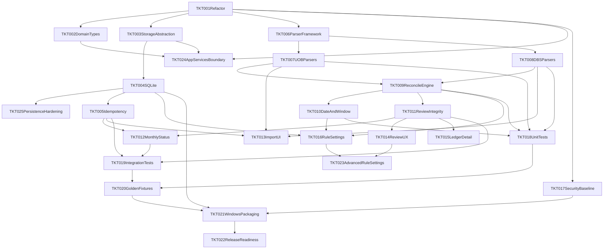

# Finny Implementation Tickets (v1)

This document breaks implementation into actionable tickets with dependencies and a recommended execution order.

References:
- [PRODUCT_REQUIREMENTS.md](PRODUCT_REQUIREMENTS.md)
- [DESIGN_REQUIREMENTS.md](DESIGN_REQUIREMENTS.md)
- [ENGINEERING_REQUIREMENTS.md](ENGINEERING_REQUIREMENTS.md)

## Current Implementation Reality (Snapshot)

- Frontend stack is React + TypeScript + Vite, packaged via Tauri.
- Tailwind CSS is already integrated (via PostCSS) and current UI styling uses utility classes.
- Core logic lives in `appServices/`, `parsers/`, `reconcile/`, `storage/`; `App.tsx` composes UI and wires storage.
- Persistence: Tauri uses SQLite under the app data directory (`src-tauri/src/db.rs`); development is **Tauri-only** (no standalone-browser persistence path).
- Initial load and save failures surface in the UI (empty workspace fallback on load failure; optimistic save with rollback on write failure).
- **Dev workflow:** Tauri-only (`npx tauri dev`). The browser-localStorage adapter and factory were removed; standalone `npm run dev` in a tab is not a supported persistence path.

## Ticket Legend

- Priority: `P0` (must-have), `P1` (important), `P2` (nice-to-have for v1 hardening)
- Type: `Foundation`, `Backend`, `Frontend`, `Quality`, `Release`

## Ticket Backlog

### TKT-001 - Restructure app into modules
- **Status:** DONE
- **Priority:** P0
- **Type:** Foundation
- **Description:** Split current monolithic `App.tsx` into module boundaries: `parsers`, `reconcile`, `storage`, `domain`, `ui` to align with architecture requirements.
- **Acceptance criteria:**
  - `App.tsx` contains composition and UI flow only.
  - Parsing/reconciliation/storage logic moved into separate files.
  - App behavior unchanged after refactor.
- **Dependencies:** None

### TKT-002 - Add domain model and shared types package
- **Status:** DONE
- **Priority:** P0
- **Type:** Foundation
- **Description:** Create canonical domain types (`ImportRecord`, `Transaction`, `ReconciliationLink`, `RuleProfile`, `MonthlyStatus`, enums).
- **Acceptance criteria:**
  - All modules consume shared types from one location.
  - No duplicate ad-hoc type definitions.
- **Dependencies:** TKT-001

### TKT-003 - Introduce storage abstraction layer
- **Status:** DONE
- **Priority:** P0
- **Type:** Foundation
- **Description:** Define `StorageAdapter` interface with methods for imports, transactions, links, settings, monthly status.
- **Acceptance criteria:**
  - UI and services depend on the storage interface, not on SQLite or IPC details.
- **Dependencies:** TKT-001, TKT-002

### TKT-004 - Implement Tauri SQLite persistence
- **Status:** DONE
- **Priority:** P0
- **Type:** Backend
- **Description:** Persist application state in Tauri-side SQLite with schema migrations.
- **Acceptance criteria:**
  - App data persists in SQLite file in local app directory.
  - Tables for imports, transactions, reconciliation links, rule profile, monthly status.
  - Migration path exists from empty DB to current schema.
- **Dependencies:** TKT-003

### TKT-025 - Persistence and IPC contract hardening
- **Priority:** P1
- **Type:** Quality / Backend
- **Description:** Follow-up work after SQLite integration: reduce drift and operational risk beyond the v0 vertical slice.
- **Acceptance criteria:**
  - **Domain parity:** Rust `AppState` (`src-tauri/src/state.rs`) and TypeScript `domain/types.ts` stay aligned (choose one: generated types from a single source, JSON Schema validation on IPC, or automated contract / round-trip tests).
  - **Validation:** Reject or normalize invalid enum strings and malformed payloads at the Tauri command boundary before writing SQL (today many fields are untyped `String` in Rust).
  - **Write strategy:** Document or replace full table replace on each save if ledger size requires incremental upserts; measure or cap worst-case save time.
  - **Links invariant:** Either enforce or document the relationship between `transactions.linked_transaction_id` and rows in `reconciliation_links` (links are currently derived from bank settlement rows on save).
  - **Tests:** Add at least one Rust integration test: temp file DB, run migrations, save and reload `AppState` (complements TKT-018/019).
- **Dependencies:** TKT-004

### TKT-005 - Implement idempotent import guardrails
- **Priority:** P0
- **Type:** Backend
- **Description:** Add file-hash based duplicate detection and normalized transaction hash dedupe to prevent duplicate rows on re-import.
- **Acceptance criteria:**
  - Re-importing same file adds no duplicate transactions.
  - Duplicate import result is visible to user as non-destructive outcome.
- **Dependencies:** TKT-004

### TKT-006 - Build parser pipeline framework
- **Priority:** P0
- **Type:** Backend
- **Description:** Introduce parser contract and parser registry by source type (`UOB_BANK`, `UOB_CARD`, `DBS_BANK`, `DBS_CARD`).
- **Acceptance criteria:**
  - `parse(file) -> ParsedDocument + ParsedEvents + warnings`.
  - Source detection and parser dispatch are isolated from UI.
- **Dependencies:** TKT-001, TKT-002

### TKT-007 - Harden UOB PDF parsers (bank + card)
- **Priority:** P0
- **Type:** Backend
- **Description:** Implement robust UOB extraction using section-aware parsing, multiline handling, and boilerplate filtering.
- **Acceptance criteria:**
  - Extract known UOB settlement/payment markers reliably.
  - Ignore non-transaction page noise.
  - Sample UOB PDFs parse into expected records.
- **Dependencies:** TKT-006, TKT-004

### TKT-008 - Harden DBS/POSB PDF parsers (bank + card)
- **Priority:** P0
- **Type:** Backend
- **Description:** Implement robust DBS/POSB extraction, including consolidated statement section filtering and reference extraction.
- **Acceptance criteria:**
  - Extract DBS bill payment markers and `REF`/`REF NO`.
  - Exclude SRS/informational sections from deposit ledger rows.
  - Sample DBS PDFs parse into expected records.
- **Dependencies:** TKT-006, TKT-004

### TKT-009 - Implement deterministic reconciliation engine v1
- **Priority:** P0
- **Type:** Backend
- **Description:** Build reconciliation service with one-to-one default and review fallback, confidence scoring, and explainability payload.
- **Acceptance criteria:**
  - Supports UOB and DBS matching evidence.
  - `NeedsReview` on ambiguous/low-confidence cases.
  - Produces spend-impact tags and state transitions.
- **Dependencies:** TKT-007, TKT-008

### TKT-010 - Implement real date normalization and match window logic
- **Priority:** P0
- **Type:** Backend
- **Description:** Parse transaction dates into structured values and apply `matchWindowDays` in candidate matching.
- **Acceptance criteria:**
  - Date parsing is deterministic for supported formats.
  - `matchWindowDays` actively affects reconciliation outcomes.
- **Dependencies:** TKT-009

### TKT-011 - Implement review actions with linked-state integrity
- **Priority:** P0
- **Type:** Backend/Frontend
- **Description:** Ensure confirm/override decisions update both sides of a link (where applicable) and persist explainability.
- **Acceptance criteria:**
  - Review actions maintain consistent link state.
  - State transitions follow `AutoMatched`, `NeedsReview`, `UserConfirmed`, `UserOverridden`.
- **Dependencies:** TKT-009, TKT-004

### TKT-012 - Home status service (`Continue monthly close`)
- **Priority:** P0
- **Type:** Backend/Frontend
- **Description:** Implement deterministic monthly status contract (`IMPORT_MISSING`, `RESOLVE_REVIEW`, `VIEW_SUMMARY`) and reason text.
- **Acceptance criteria:**
  - Home CTA route reason matches status contract.
  - Status computed from imports + unresolved review counts.
- **Dependencies:** TKT-005, TKT-011

### TKT-013 - Import UI hardening and feedback states
- **Priority:** P1
- **Type:** Frontend
- **Description:** Improve import screen with per-file status, warnings, duplicate/reprocess messaging, and failure categories.
- **Acceptance criteria:**
  - User can distinguish success, partial, failed, duplicate outcomes.
  - Non-transaction section handling surfaces as info, not fatal errors.
  - Styling implementation remains Tailwind-first (no new legacy stylesheet dependency).
- **Dependencies:** TKT-007, TKT-008, TKT-005

### TKT-014 - Review queue UX hardening
- **Priority:** P1
- **Type:** Frontend
- **Description:** Add reason codes, confidence, extracted markers (card token/reference), stable ordering, and empty state polish.
- **Acceptance criteria:**
  - Each review item shows what/why/spend impact.
  - Supports confirm + override flows cleanly.
- **Dependencies:** TKT-011

### TKT-015 - Ledger + detail explainability view
- **Priority:** P1
- **Type:** Frontend
- **Description:** Add ledger filters and detail drawer/page with source trace and reconciliation explanation contract.
- **Acceptance criteria:**
  - Filter by account/source, needs review, settlement-related.
  - Transaction detail shows source import + reasoning payload.
  - Reusable UI primitives are used where feasible (for example panel/table/button patterns), implemented in Tailwind-friendly components.
- **Dependencies:** TKT-011

### TKT-016 - Rule profile settings (MVP-minimum)
- **Priority:** P1
- **Type:** Frontend/Backend
- **Description:** Finalize MVP settings for match window, confidence threshold, and card payment source mappings.
- **Acceptance criteria:**
  - Settings persist via storage layer.
  - Changes influence reconciliation behavior.
- **Dependencies:** TKT-009, TKT-010, TKT-004

### TKT-023 - Advanced rule profile options (Post-v1)
- **Priority:** P2
- **Type:** Frontend/Backend
- **Description:** Add advanced configurable rules such as transfer patterns, salary source account, and richer description pattern controls.
- **Acceptance criteria:**
  - Advanced fields are configurable and validated.
  - Changes are traceable and do not regress deterministic rule precedence.
- **Dependencies:** TKT-016, TKT-014

### TKT-024 - Introduce application service boundary
- **Status:** DONE
- **Priority:** P0
- **Type:** Foundation
- **Description:** Add an `appServices` layer so UI calls use-case functions only (for example `importStatements`, `resolveReviewItem`, `getMonthlyStatus`) and does not orchestrate parser/reconcile/storage directly.
- **Acceptance criteria:**
  - `App.tsx` (and future UI components) consume service methods instead of directly calling parser/reconcile/storage modules.
  - Service layer owns orchestration order and error mapping for import and review workflows.
  - Module dependencies become one-directional: `ui -> appServices -> domain/infrastructure`.
- **Dependencies:** TKT-001, TKT-002, TKT-003

### TKT-017 - Security baseline for Tauri app
- **Status:** DONE
- **Priority:** P1
- **Type:** Quality
- **Description:** Replace `csp: null` with least-privilege CSP and verify no unnecessary capabilities.
- **Acceptance criteria:**
  - Tauri config has explicit CSP policy.
  - App still runs and builds successfully.
- **Dependencies:** TKT-001

### TKT-018 - Unit tests for parser and reconciliation core
- **Priority:** P0
- **Type:** Quality
- **Description:** Add unit tests for source detection, parser extraction, date normalization, matching precedence, and review fallback.
- **Acceptance criteria:**
  - Test suite covers UOB and DBS sample-driven cases.
  - Failing tests reproduce known edge cases.
- **Dependencies:** TKT-007, TKT-008, TKT-009, TKT-010

### TKT-019 - Integration tests for import->reconcile->review
- **Priority:** P0
- **Type:** Quality
- **Description:** Build integration tests validating end-to-end pipeline and state persistence.
- **Acceptance criteria:**
  - Re-import idempotency verified.
  - Review actions and monthly status flow verified.
- **Dependencies:** TKT-005, TKT-011, TKT-012

### TKT-020 - Acceptance test fixtures and golden outputs
- **Priority:** P0
- **Type:** Quality
- **Description:** Add anonymized fixtures and expected outputs for UOB/DBS settlement + transfer scenarios.
- **Acceptance criteria:**
  - Golden files maintained for expected links/totals.
  - CI check compares outputs deterministically.
- **Dependencies:** TKT-018, TKT-019

### TKT-021 - Windows packaging and installer smoke tests
- **Priority:** P0
- **Type:** Release
- **Description:** Build Tauri Windows package and validate install/launch/update (manual reinstall) workflow.
- **Acceptance criteria:**
  - Installer builds successfully.
  - App launches and runs core monthly flow offline.
- **Dependencies:** TKT-004, TKT-017, TKT-020

### TKT-022 - v1 release readiness checklist
- **Priority:** P0
- **Type:** Release
- **Description:** Consolidate go/no-go checks: docs alignment, test pass, known issues, migration notes, rollback instructions.
- **Acceptance criteria:**
  - Checklist approved and signed off.
  - Release candidate tagged and archived.
  - Locked v1 constraints verified in checklist: `Tauri`, `PDF-first`, `one-to-one + review fallback`, `manual reinstall updates`.
- **Dependencies:** TKT-021

## Follow-up engineering (review notes, tracked as TKT-025)

Items intentionally left for TKT-025 rather than patched ad hoc:

| Topic | Notes |
|-------|--------|
| TS / Rust model drift | Two hand-written `AppState` shapes; runtime serde errors possible if only one side changes. |
| Stringly-typed fields in Rust | `source_type`, `kind`, etc. accept any string from IPC until validation exists. |
| Full-replace save | Simple and correct for small data; may need incremental strategy for large ledgers. |
| Automated tests | No DB round-trip test yet; fold into TKT-018 scope or TKT-025 acceptance criteria. |

## Dependency Graph (Simplified)

## Execution Strategy

### Phase 1 - Stabilize core architecture (Week 1)
- Execute: TKT-001, TKT-002, TKT-003, TKT-004, TKT-017
- Goal: remove prototype risks (localStorage, monolith, weak security defaults).

### Phase 2 - Parsing and correctness engine (Week 1-2)
- Execute: TKT-006, TKT-007, TKT-008, TKT-009, TKT-010, TKT-011
- Goal: deterministic, explainable reconciliation with review fallback.

### Phase 3 - Workflow completion (Week 2)
- Execute: TKT-005, TKT-012, TKT-013, TKT-014, TKT-015, TKT-016
- Goal: complete monthly close flow with robust UI feedback.

### Phase 4 - Quality and release (Week 3)
- Execute: TKT-018, TKT-019, TKT-020, TKT-021, TKT-022
- Goal: confidence for shipping Windows installer.

## Fast-Track (If shipping pressure is high)

If turnaround must be extremely fast, cut to a minimum critical path:
- TKT-001, TKT-003, TKT-004, TKT-006, TKT-007, TKT-008, TKT-009, TKT-010, TKT-005, TKT-011, TKT-012, TKT-018, TKT-021

Minimum fixture baseline still required in fast-track:
- At least one UOB bank/card sample pair and one DBS bank/card sample pair in test fixtures.

Defer to post-v1:
- TKT-015 polish depth
- TKT-023 advanced profile options
- TKT-020 golden fixture breadth

