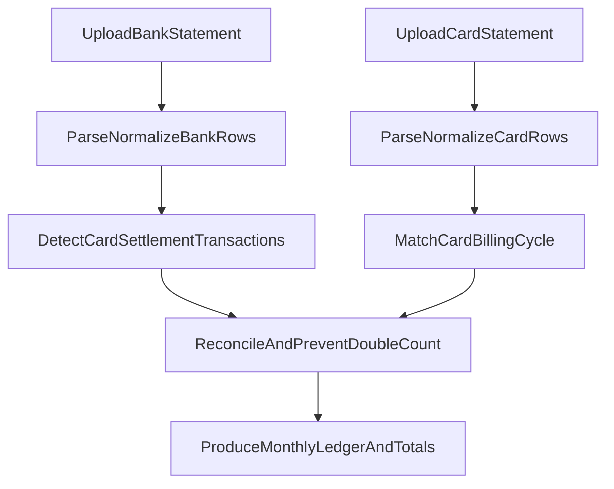

# Personal Finance Tracker - Product Requirements (v1)

## 1) Purpose
Define the MVP product requirements for a local-only personal finance tracker that imports monthly bank and credit card statements, reconciles account movements, and avoids double counting credit card settlement payments.

## 2) Product Goal
Help a user maintain an accurate monthly personal finance ledger using statement uploads, while keeping all data and processing on the local machine.

## 2.1) Problem Statement (User Pain)
- Monthly finance tracking across bank and credit card statements is time-consuming and error-prone when done manually.
- Credit card settlement payments shown in bank statements can be double-counted as spending unless manually reconciled.
- Existing tools often assume cloud sync or bank connectivity, which conflicts with strict local-only privacy needs.

## 2.2) Success Metrics (MVP)
- Monthly close can be completed in under 15 minutes for a typical 4-statement month (UOB bank, DBS bank, UOB card, DBS card).
- At least 80% of settlement links are auto-matched with no manual edits for the primary user workflow after initial rule setup.
- 0 known double-counted spend items in the acceptance-test dataset.
- Re-importing the same source files results in 0 duplicate ledger entries.

## 3) Target User
- Primary: single user managing personal finances across UOB and DBS accounts/cards.
- Secondary (future validation): users with different bank/payment workflows using configurable rules.

## 3.1) Ownership and Decision Log
- Product owner: project user (primary operator of the app).
- Doc owner: this PRD remains the source of truth for product scope.
- Last major update: v1 baseline with PM-quality refinements.

## 4) Product Principles
- Local-first privacy: data never leaves the machine unless explicitly exported by user action.
- Correctness before convenience: uncertain matches are surfaced for review, not silently auto-applied.
- Auditability: each ledger entry can be traced back to source statement rows and reconciliation decisions.
- Repeatability: re-importing the same source should be safe and not create duplicates.

## 5) Platform Direction
- Recommended MVP delivery: packaged local desktop executable (Windows-first).
- Usage target for v1: laptop/desktop only.
- Requirement: app must launch without developer tooling and run core flows fully offline after installation.
- Requirement: core product behavior and data model should remain platform-agnostic to allow future packaging/runtime changes without product-level redesign.

## 6) Scope: In-Scope for MVP
1. Statement import
   - Import monthly bank statements from UOB and DBS.
   - Import monthly credit card statements from UOB and DBS.
2. Normalization and ledgering
   - Parse uploaded statements into a common transaction schema.
   - Store normalized transactions in a unified ledger.
3. Duplicate protection
   - Detect and prevent duplicate ledger entries on repeated imports.
4. Reconciliation and settlement handling
   - Identify bank transactions that are credit card settlement payments.
   - Link settlement payments to the relevant card statement period.
   - Exclude settlement payments from spend totals when card line items are present.
5. Manual review workflow
   - Mark low-confidence matching outcomes as "Needs Review".
   - Allow user override/edit of reconciliation outcomes.

## 6.1) Prioritization (MoSCoW)
- Must have
  - Local-only runtime behavior.
  - UOB/DBS bank + card statement ingestion.
  - Normalized ledger with source traceability.
  - Settlement detection and double-count prevention.
  - Duplicate-safe re-import and review queue.
- Should have
  - Configurable rule profiles for account mappings and description patterns.
  - Explainable reconciliation details in UI.
- Could have
  - Reusable rule templates for onboarding additional users quickly.
- Won't have (v1)
  - Online data sync, direct bank APIs, collaborative/multi-user cloud features.

## 7) Out of Scope for MVP
- Bank API connectivity or automatic fetching from banks.
- Cloud sync, backup, account sharing, or collaboration features.
- Multi-device synchronization.
- Investment/portfolio tracking.
- OCR-heavy ingestion quality guarantees for all statement layouts (format support evolves iteratively).

## 8) Core User Jobs
- Upload monthly statements with minimal friction.
- Produce one accurate monthly financial view across bank accounts and cards.
- Understand where totals come from and why entries were linked/excluded.
- Fix auto-reconciliation decisions quickly when needed.

## 8.1) Key User Scenarios (End-to-End)
### Scenario A: Standard monthly close (primary flow)
1. User uploads 4 monthly statements (UOB bank, DBS bank, UOB card, DBS card).
2. System parses and normalizes rows into the ledger.
3. System auto-detects transfer and settlement links.
4. User reviews only `NeedsReview` items.
5. System produces final monthly totals without double counting.

### Scenario B: Re-import same files
1. User re-uploads an already imported statement file.
2. System identifies duplicate import and performs idempotent handling.
3. Ledger remains unchanged except for import audit metadata if applicable.

### Scenario C: Low-confidence settlement
1. System finds multiple possible settlement matches.
2. Item is marked `NeedsReview`.
3. User confirms or remaps link.
4. Decision is persisted for future deterministic handling of identical matching conditions.

## 9) Functional Requirements

### FR-1: Local-Only Operation
- The app must run entirely locally.
- No outbound network transmission for transactional/user data during normal operation.
- If dependencies require network at install time, this must be outside runtime behavior and clearly documented.

### FR-2: Statement Ingestion
- User can upload bank and card statements monthly.
- System records source metadata for each import (institution, account/card type, statement period, filename).
- System blocks exact duplicate file imports or maps them to idempotent reprocessing.

### FR-3: Transaction Normalization
- Normalize source data into canonical fields:
  - Date
  - Description
  - Amount
  - Debit/Credit direction
  - Currency
  - Account/Card identifier
  - Source statement identifier
- Preserve raw-source trace for audit/debug.

### FR-4: Ledger Generation
- Maintain a transaction ledger that supports:
  - Raw imported transactions
  - Derived links (e.g., settlement-to-statement mapping)
  - Reconciliation state (`AutoMatched`, `NeedsReview`, `UserConfirmed`, `UserOverridden`)

### FR-5: Payment Settlement Detection
- Detect bank entries representing payment of UOB/DBS credit card bills.
- Use deterministic matching rules (amount, date window, account/card mapping, description patterns), with minimum configurable thresholds/mappings in v1.
- Produce confidence score for each detected settlement link.

### FR-6: Double-Count Prevention
- When card statement line items are present for the same billing cycle, linked settlement payment is treated as transfer/settlement movement, not additional spend.
- Totals and reports for spending must avoid counting both:
  - underlying card transactions, and
  - bank-side settlement payment.

### FR-7: Manual Exception Handling
- Any low-confidence or conflicting match goes to review queue.
- User can confirm, reject, or remap settlement links.
- User decisions are persisted and reapplied for future identical matching conditions (same rule inputs), while broader rule-learning is out of scope for v1.

## 10) UOB/DBS Use Case Requirements (Current User)

### UC-1: UOB Card Settlement Flow
- UOB credit card bills paid from UOB bank account appear in UOB bank statement.
- System must recognize these entries as settlement payments and avoid counting them as independent spend transactions.

### UC-2: DBS Card Settlement Flow with UOB Salary Source
- Salary lands in UOB account.
- User transfers funds from UOB to DBS.
- DBS credit card bills are paid from DBS account and appear in DBS bank statement.
- System must:
  - treat UOB->DBS transfer as account movement (not spend),
  - treat DBS->DBS card payment as settlement (not additional spend if card lines imported),
  - still preserve full transaction traceability.

## 11) Configurability Requirements (Multi-User Readiness)
- Reconciliation behavior must be configurable via rule profiles.
- MVP minimum configurable dimensions:
  - Card payment source account mappings
  - Inter-bank transfer patterns
  - Match windows and confidence thresholds
- Post-MVP configurable dimensions:
  - Salary source account
  - Description keyword/pattern rules
- Rule system requirements:
  - deterministic precedence ordering
  - conflict detection with `NeedsReview` fallback
  - explainable match output (which rule matched and why)

## 12) Non-Functional Requirements

### NFR-1: Privacy & Security
- No network dependency required for core runtime.
- Data stored locally with clear directory location and user-visible management controls.
- Optional local export/import backup capability may be introduced later; not required in MVP.

### NFR-2: Performance
- Monthly import processing should complete quickly for typical personal statement sizes.
- Reconciliation should run incrementally and avoid full recomputation when possible.

### NFR-3: Reliability
- Re-imports are idempotent.
- Parse/reconciliation failures should not corrupt existing ledger state.

### NFR-4: Explainability
- For each reconciliation decision, user can view:
  - source transactions involved,
  - applied rule (if any),
  - confidence and final status.

### NFR-5: Executable Packaging and Operability
- MVP must be deliverable as a user-launchable local application package (no developer tooling required to run).
- Windows executable installer/package is required for v1; additional OS packages are optional.
- After installation, core flows must work offline without runtime internet connectivity.
- Application runtime and data storage locations must be local and user-visible.

## 13) Acceptance Criteria (MVP Exit)
1. User can import monthly UOB/DBS bank statements and UOB/DBS card statements in a single workflow.
2. System generates one coherent ledger with source traceability for all imported entries.
3. Credit card settlement payments in bank statements are detected and linked to card billing cycles.
4. Spending totals do not double count card transactions plus settlement payments.
5. UOB salary -> UOB to DBS transfer -> DBS card payment flow is modeled without misclassifying transfers/settlements as spend.
6. At least one manual-review path exists for unresolved or low-confidence matches.
7. Re-importing the same statements does not create duplicate transactions.
8. User can install and launch the app as a local executable package and complete the monthly flow without developer setup.

## 14) Risks and Product Assumptions
- Statement layout variability may reduce parser reliability across bank-issued formats.
- Rule complexity can grow quickly as more user workflows are onboarded.
- Assumption: user is willing to perform monthly uploads and occasional manual review.

## 14.1) Edge Cases and Failure Modes
- Missing one or more monthly statements (incomplete import set).
- Wrong file uploaded (unsupported format or incorrect account type).
- Revised/reissued statements for the same month.
- Amount mismatch between card bill payment and expected billing-cycle total.
- Multiple cards from the same bank paid in a single consolidated transaction.
- Transfer-like transactions with ambiguous narration/description.
- Multi-line transaction descriptions where signal text spans lines (for example payment channel + card marker + masked card number).
- Cross-cycle linking where bank payment appears near month-end but card statement payment credit appears in next statement cycle.

## 15) Open Decisions for Next Iteration
- Exact file formats for MVP statement support (`CSV`, `PDF`, or both first).
- Minimum "review queue" UX depth required for v1.
- Data retention/export expectations for local backups.
- Future envelope for broader bank support beyond UOB/DBS.

## 15.1) Explicit Constraints (Current Working Assumptions)
- v1 supports user-initiated monthly uploads only (no background ingestion).
- v1 assumes SGD-centric personal finance usage; multi-currency handling is basic unless specified otherwise.
- v1 focuses on UOB/DBS parser and reconciliation correctness before adding new banks.

## 15.1.1) Future Extensibility Principle (Non-MVP)
- Future capabilities may include SRS support, investment portfolio support, credit card rewards tracking, and dashboards/charts.
- These capabilities are out of scope for v1 delivery, but v1 implementation must not hardcode assumptions that block adding new financial domains later.
- Domain language in requirements and workflows should remain reusable beyond bank/card cashflow use cases.

## 15.2) Evidence-Based Notes (Statement Samples)
- Both UOB and DBS/POSB samples contain identifiable settlement/payment markers in bank and card statements suitable for deterministic linking.
- Reference identifiers are available in some statement pairs and should be treated as strong matching evidence when present.
- Real statements contain repeated boilerplate and non-transaction sections; parsing must be section-aware.
- Detailed parser/matching signatures are defined in the engineering requirements document.

## 16) Product Flow Overview

## 17) Glossary
- Settlement payment: bank transaction representing payment of a credit card bill.
- Billing cycle: statement period for a credit card account.
- Ledger: normalized transaction store used for reporting and reconciliation.
- Reconciliation: process of linking related transactions and preventing double counting.
- Rule profile: configurable matching settings for a user's account/payment patterns.

## 18) Handoff to Engineering (Next Doc Inputs)
- Decide v1 statement format support sequence (`CSV` first, `PDF` first, or both) and expected parser reliability targets.
- Choose desktop packaging/runtime approach for executable delivery (Windows-first), including installer/update strategy.
- Define reconciliation rule execution model and conflict-resolution contract that implements FR-5 to FR-7 deterministically.
- Define local data model/storage layout to satisfy auditability, idempotent re-imports, and explainability requirements.
- Define acceptance-test dataset and pass criteria for UOB/DBS settlement and UOB->DBS transfer flows.
